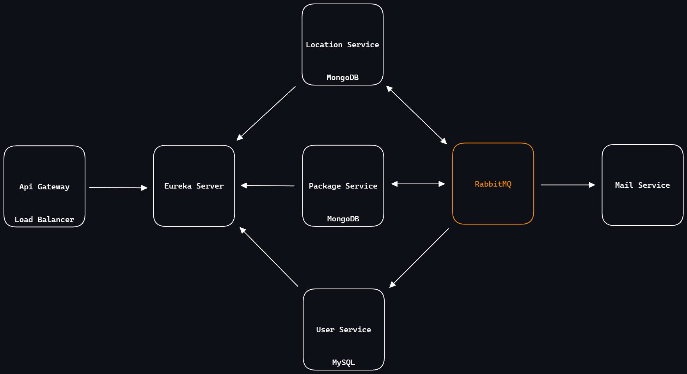

# Cargo Microservices

This repository contains a collection of microservices developed using Spring Boot, each serving a specific purpose within the application ecosystem. Additionally, the project includes components such as Eureka Server for service discovery, an API Gateway for routing requests, and RabbitMQ for messaging between services.

## Technologies and Tools

- Spring Boot
- Eureka Server
- Gateway
- RabbitMQ
- MySQL
- MongoDB
- Docker

## Getting Started

To run the microservices and infrastructure components locally, follow these steps:

1. **Clone the Repository:**
```bash
   git clone https://github.com/augurcan/cargo-microservices.git
```
2. Ensure Docker is installed.
3. Open the terminal in the project root directory and run the following command:

```bash
  docker-compose up -d
```

## To stop the services
Open the terminal in the project root directory and run the following command:
```bash
  docker-compose down
```

# Project Structure

The project consists of multiple microservices, each leveraging its independent database. Eureka Server facilitates dynamic service discovery, while Gateway manages incoming request routing.



## Services

### 1. Package Service

The Package Service manages packages within the system. It provides endpoints for creating, updating, deleting, and retrieving package information. This service automatically creates a new location entry in the Location Service when a package is created. Additionally, if sender and recipient information is not available in the User Service, this service automatically creates user records for them. Package Service communicates with other services via RabbitMQ for messaging. It utilizes MongoDB as its database.

### 2. Location Service

The Location Service is responsible for managing addresses associated with package deliveries. It automatically creates a new address entry when a package is created in the Package Service. When a package is moved to a new address (delivery), this service updates the address information. Additionally, when the delivery status of a package becomes true, it notifies the Package Service about the delivery status change. This service utilizes MongoDB as its database.

### 3. User Service


The User Service automatically saves sender and recipient information during package creation and manages tasks related to the user within the application, including get, updating, and deletion. The User Service utilizes MySQL as the database for data storage.
### 4. Mail Service

The Mail Service sends email notifications to the sender and recipient when the delivery status of a package becomes true in the Package Service.

## Services and Endpoints
1. package-service
   
	- GET
		* http://localhost:8888/v1/api/package
		* http://localhost:8888/v1/api/package/{packageId}
	- POST
		* http://localhost:8888/v1/api/package
	- PUT
		* http://localhost:8888/v1/api/package/{packageId}
	- DELETE
		* http://localhost:8888/v1/api/package/{packageId}

- PackageRequest:
```json

		{
			  "sender": {
				"name": "",
				"surname": "",
				"phoneNumber": "",
				"email": "",
				"identificationNumber": 
			  },
			  "recipient": {
				"name": "",
				"surname": "",
				"phoneNumber": "",
				"email": "",
				"identificationNumber": 
			  },
			  "content": "",
			  "weight": ,
			  "dimension": "",
			  "deliveryService": "",
			  "deliveryStatus": ,
			  "shippingFees": ,
			  "deliveryAddress": {
				"city": "",
				"district": "",
				"postalCode": "",
				"street": "",
				"detail": ""
			  }
		}


```
2. location-service
   
	- GET
		* http://localhost:8888/v1/api/location/package
	- POST
		* http://localhost:8888/v1/api/location/package/{packageId}/address
	- PUT
		* http://localhost:8888/v1/api/location/package/{packageId}/address/{addressIndex}
	- DELETE
		* http://localhost:8888/v1/api/location/{locationId}

- AddAddressRequest:
```json

		{
		  "address": {
			"city": "",
			"district": "",
			"postalCode": "",
			"street": "",
			"detail": ""
		  },
		  "deliveryStatus": 
		}
```
3. user-service
   
	- GET
		* http://localhost:8888/v1/api/user
	- POST
		* http://localhost:8888/v1/api/user
	- PUT
		* http://localhost:8888/v1/api/user/{userId}
	- DELETE
		* http://localhost:8888/v1/api/user/{userId}

- AddUserRequest:
```json

		{
			"name": "",
			"surname": "",
			"phoneNumber": "",
			"email": "",
			"identificationNumber":
		}
```
